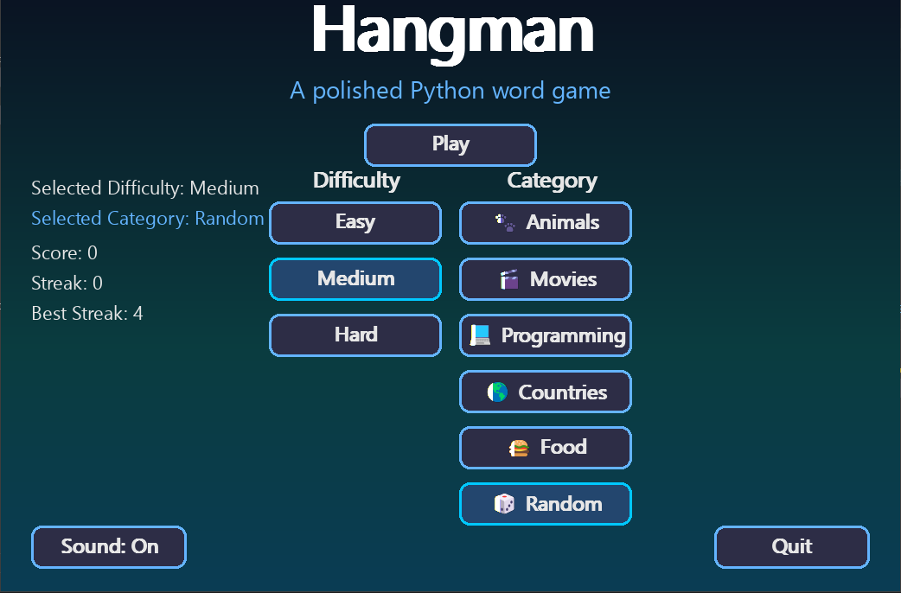
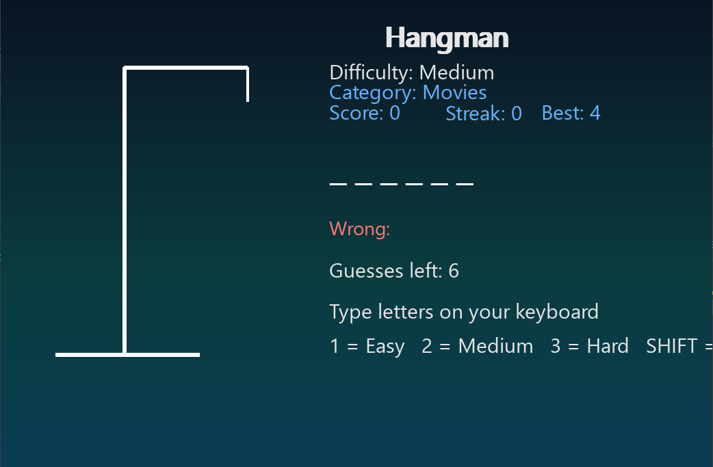
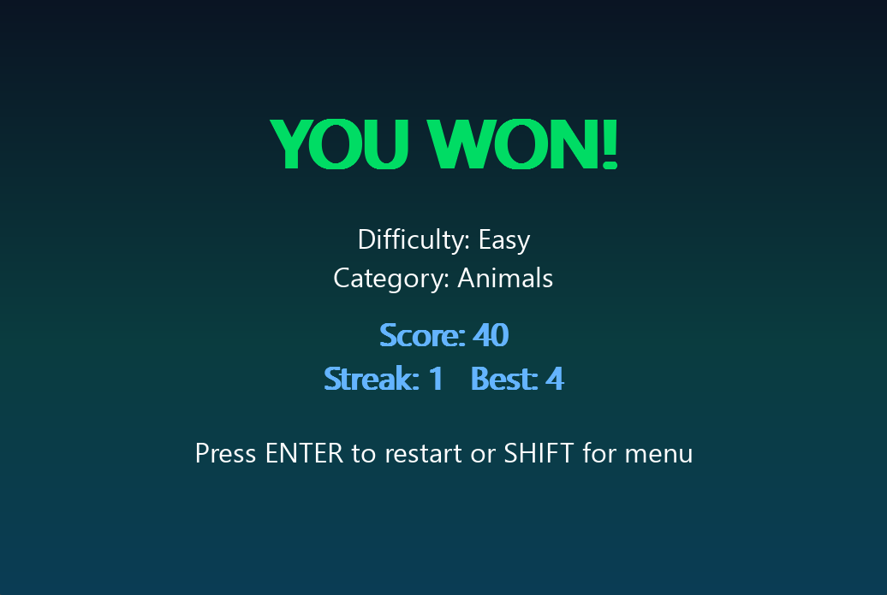
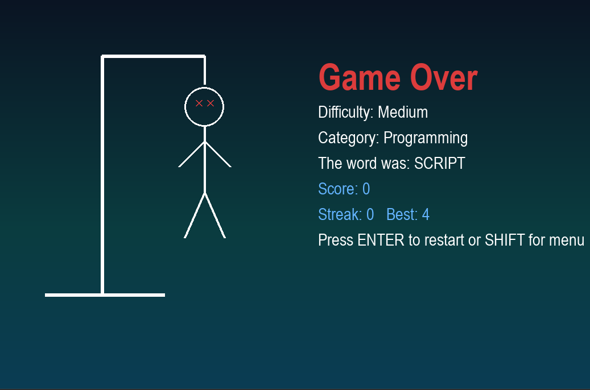

🎮 Hangman GUI

""Download" (https://img.shields.io/badge/Download-Windows%20Executable-blue?style=for-the-badge)" (https://github.com/garvinedwards717-cloud/Hangman-GUI/releases)
"Python" (https://img.shields.io/badge/Python-3.13-blue?style=for-the-badge)
"Pygame" (https://img.shields.io/badge/Pygame-2.6-green?style=for-the-badge)

A polished desktop Hangman word game built with Python and Pygame, featuring a modern animated interface, selectable categories, difficulty levels, sound effects, and persistent scoring.

---

🎥 Demo

  

---

✨ Features

✔ Modern animated menu interface
✔ Multiple difficulty levels
✔ Word categories with icons
✔ Sound effects and background music
✔ Score and streak tracking
✔ Best streak saved between sessions
✔ Clean modular project structure
✔ Packaged Windows executable

---

🎯 Difficulty Levels

Level| Description
Easy| Short and common words
Medium| Standard vocabulary
Hard| Longer and more challenging words

---

📂 Word Categories

• Animals 🐾
• Movies 🎬
• Programming 💻
• Countries 🌍
• Food 🍔
• Random 🎲

---

📸 Screenshots

Main Menu

Gameplay

Win Screen

Lose Screen

---

⬇ Download

Download the Windows version of Hangman here:

👉 https://github.com/garvinedwards717-cloud/Hangman-GUI/releases

After downloading:

1. Extract the zip file
2. Run Hangman-GUI.exe

No Python installation required.

---

🎮 Controls

Key| Action
A–Z| Guess letters
1| Easy difficulty
2| Medium difficulty
3| Hard difficulty
SHIFT| Change category
Mouse| Navigate menu

---

⚙ Installation (Developer)

If you want to run the game from source:

Clone the repository

git clone https://github.com/garvinedwards717-cloud/Hangman-GUI.git

cd Hangman-GUI

Install dependencies

pip install -r requirements.txt

Run the game

python src/main.py

---

🗂 Project Structure

Hangman-GUI
│
├── screenshots
│   ├── demo.gif
│   ├── gameplay.png
│   ├── menu.png
│   ├── win.png
│   └── lose.png
│
├── sounds
│   ├── background.mp3
│   ├── correct.wav
│   ├── wrong.wav
│   ├── win.wav
│   └── lose.wav
│
├── src
│   ├── main.py
│   ├── ui.py
│   └── game_logic.py
│
├── requirements.txt
├── save_data.json
└── README.md

---

🚀 Future Improvements

• Leaderboard system
• Additional word categories
• Animated hangman drawing stages
• Cross-platform builds (Mac/Linux)

---

👨‍💻 Author

Garvin Edwards
Python Developer | Automation & Desktop Tools

GitHub:
https://github.com/garvinedwards717-cloud